<!-- ══════════════════════════════════════════════════════════════════ -->
<!--                        Yozorua's GitHub Profile                    -->
<!-- ══════════════════════════════════════════════════════════════════ -->

 

 

---

## ✦ &nbsp;About Me

 

 

---

## ✦ &nbsp;Tech Stack

 

### Languages

### Tools & Environment

 

---

## ✦ &nbsp;GitHub Stats

 

&nbsp;&nbsp;

  

 

---

## ✦ &nbsp;Trophies

 

  

 

---

## ✦ &nbsp;Contribution Activity

 

  

 

---

### ✦ &nbsp;Connect

 

&nbsp;

&nbsp;

&nbsp;

 

  

*✦ &nbsp;Thank you for visiting my corner&nbsp;✦*

